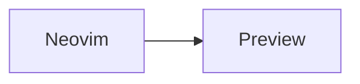

# md-peek.nvim

Write Markdown in Neovim and read it in a fast browser preview that stays in sync with every edit—chromeless in Chromium, or in a dedicated Firefox window.

`md-peek.nvim` follows the same philosophy as [`ipynb-peek.nvim`](https://github.com/AmaneKai/ipynb-peek.nvim): Neovim is the editor, a small browser window is the renderer, and the boundary between them should feel nearly invisible. It brings the reading features of the [Markdown Viewer browser extension](https://github.com/simov/markdown-viewer) into that workflow without requiring a browser extension.

## Features

- Live preview of unsaved buffer changes, debounced as you type
- Two-way source synchronization:
  - moving the Neovim cursor reveals and highlights the corresponding rendered block
  - clicking a rendered block moves the Neovim cursor to its source line
- GitHub-flavored Markdown: tables, task lists, autolinks, strikethrough, and fenced code
- Syntax highlighting with automatic language detection and one-click code copying
- KaTeX math using `$...$`, `$$...$$`, `\(...\)`, and `\[...\]`
- Mermaid diagrams from `mermaid` or `mmd` fenced blocks
- `:emoji:` shortcodes, footnotes, YAML front matter, and GitHub-style alerts
- Generated, collapsible table of contents with stable heading anchors
- Neovim-native live status HUD and floating Markdown outline
- Local relative images, click-to-zoom, and lazy loading
- Relative links to other Markdown files open those files in Neovim
- Raw/rendered view toggle
- Remembered reader theme and preserved scroll position
- Reading progress, print/save-to-PDF, and HTML export
- Built-in `dark`, `github`, `tokyonight`, `gruvbox`, and `rose-pine` themes, plus color/font/CSS overrides
- Responsive layout for narrow popup windows
- Offline, self-contained renderer after installation; no CDN scripts or styles
- Token-protected loopback server, sanitized raw HTML, strict CSP, and no public network listener

Browser-extension-only concerns such as remote-origin permissions, response `Content-Type` detection, page encoding overrides, and CSP rewriting do not apply: md-peek renders the current Neovim buffer directly.

## Requirements

- Neovim 0.10+
- Node.js 22.18+ (or 24.2+)
- Chrome, Brave, Edge, Chromium, or Firefox

`browser = "auto"` prefers Chromium's chromeless app mode and falls back to Firefox. Firefox supports every rendering and synchronization feature, but Firefox does not expose a Chromium-style `--app` mode, so its dedicated preview retains normal browser chrome. Run `:checkhealth md-peek` to inspect the setup.

Each preview uses a temporary, isolated browser profile and an attached Neovim job. Closing the preview or exiting Neovim therefore stops only the browser instance owned by md-peek; it does not close the user's normal browser session.

## Installation

With lazy.nvim:

```lua
{
  "AmaneKai/md-peek.nvim",
  build = "cd server && npm install",
  ft = { "markdown", "mdx" },
  cmd = { "MdPeekOpen", "MdPeekClose", "MdPeekToggle", "MdPeekRefresh", "MdPeekOutline" },
  config = function()
    require("md-peek").setup()
  end,
}
```

With packer.nvim:

```lua
use({
  "AmaneKai/md-peek.nvim",
  run = "cd server && npm install",
  config = function()
    require("md-peek").setup()
  end,
})
```

For a manual install, run `npm install` inside the plugin's `server/` directory, then call:

```lua
require("md-peek").setup()
```

## Usage

Open a Markdown buffer and run:

```vim
:MdPeekOpen
```

Available commands:

| Command          | Action                                        |
| ---------------- | --------------------------------------------- |
| `:MdPeekOpen`    | Open the current Markdown buffer's preview    |
| `:MdPeekClose`   | Close the window and stop its local server    |
| `:MdPeekToggle`  | Toggle the preview                            |
| `:MdPeekRefresh` | Force an immediate full render                |
| `:MdPeekOutline` | Open a floating heading outline inside Neovim |

Default buffer-local mappings:

| Mapping      | Action                  |
| ------------ | ----------------------- |
| `<leader>mo` | Open                    |
| `<leader>mc` | Close                   |
| `<leader>mp` | Toggle                  |
| `<leader>mr` | Refresh                 |
| `<leader>mm` | Open the Neovim outline |

Only one document preview is active at a time. This keeps popup ownership, relative assets, and cursor synchronization unambiguous.

## Configuration

Every field is optional; these are the defaults:

```lua
require("md-peek").setup({
  -- Discovered from the plugin's install path. Usually leave this nil.
  server_dir = nil,

  debounce_ms = 80,
  cursor_debounce_ms = 45,
  startup_timeout_ms = 10000,
  auto_open = false,
  browser = "auto", -- auto, chromium, or firefox

  window = { width = 1100, height = 1000 },
  position = { x = 40, y = 40 },

  nvim = {
    status_overlay = false, -- opt-in live preview/section/progress HUD
    status_width = 42,
    outline_width = 76,
    outline_height = 20,
    border = "rounded",
    winblend = 6,
  },

  keymaps = {
    open = "<leader>mo",
    close = "<leader>mc",
    toggle = "<leader>mp",
    refresh = "<leader>mr",
    outline = "<leader>mm",
  },

  preview = {
    theme = "dark", -- dark, github, tokyonight, gruvbox, rose-pine
    toc = true,
    toc_open = false, -- initial sidebar state; the toolbar button still toggles it
    math = true,
    mermaid = true,
    emoji = true,
    raw_toggle = true,
    code_copy = true,
    scroll_sync = true,
    preserve_scroll = true,

    -- Markdown compiler options
    breaks = false,
    linkify = true,
    typographer = false,
    allow_html = true,
    sanitize = true,

    max_width = 920,
    font = {
      -- ui = "Inter, sans-serif",
      -- mono = "JetBrains Mono, monospace",
      -- size = 16,
    },
    colors = {
      -- bg = "#17191d",
      -- fg = "#d7dae0",
      -- surface = "#20232a",
      -- border = "#353a45",
      -- muted = "#8b93a5",
      -- accent = "#70a5eb",
      -- heading = "#edf1f7",
      -- code = "#242830",
    },
    custom_css = "",
  },
})
```

Set a mapping to `false` or an empty string to disable it. Configuration that changes the frontend is applied when the preview server starts; close and reopen an existing preview after changing it.

## Markdown extras

Mermaid:



Math:

Euler's identity is $e^{i\pi} + 1 = 0$.

$$
\int_0^1 x^2\,dx = \frac{1}{3}
$$

GitHub-style alerts:

> [!NOTE]
> The preview follows your cursor.

## How it works

Opening a preview starts one Node process bound to `127.0.0.1` on an operating-system-assigned port. Neovim and that attached child process exchange newline-delimited JSON through persistent standard input and output streams, so live updates do not start per-edit processes or make local HTTP requests. The browser receives updates over a WebSocket, and browser clicks return through the same Node job channel.

The session token is freshly generated for each preview and required by every stateful route. Raw HTML is sanitized by default, and the page uses a restrictive Content Security Policy. Relative local assets are served only through the token-authenticated preview session. Asset paths are confined to the Markdown document's real directory; parent traversal and symlinks that resolve outside that directory are rejected.

The browser renderer and its math fonts are committed in `server/dist/`; runtime rendering never fetches libraries from a CDN. Optional KaTeX and Mermaid code is loaded from local chunks only when the active document needs it.

## Development

```sh
make build       # rebuild server/dist
make testlua     # headless Neovim smoke test
make testserver  # server integration tests
make test        # both test suites
```

CI runs the Lua launch and cleanup smoke tests on Ubuntu, macOS, and Windows. The server and browser-client suite runs on Ubuntu.

## License

MIT
